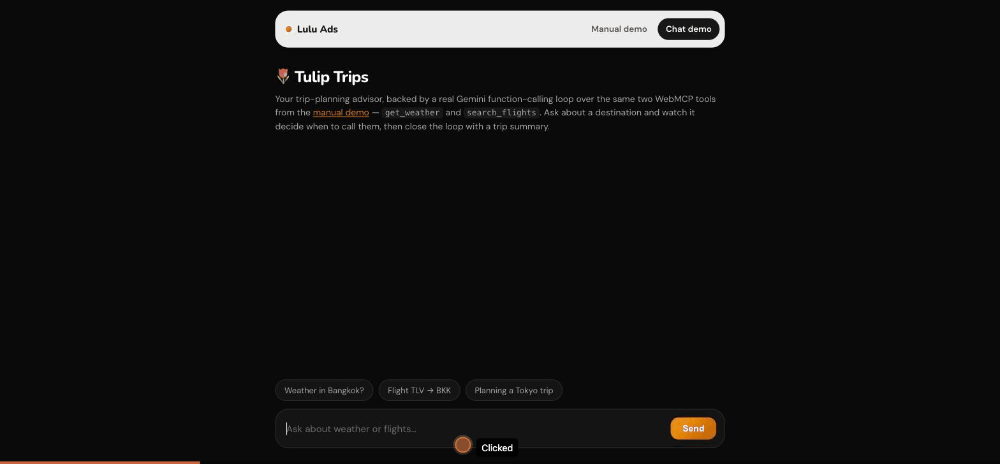

# WebMCP — Tulip Trips

**A real WebMCP page, honestly monetized.** Two live tools —
`get_weather` and `search_flights` — registered directly on the page via
`document.modelContext.registerTool`, callable by any WebMCP-capable
browser agent with zero screenshots and zero clicking. A disclosed,
labeled sponsored recommendation surfaces naturally alongside real results,
powered by [Lulu Ads](https://getlulu.dev).

🔗 **Live:**
[ads.getlulu.dev/webmcp](https://ads.getlulu.dev/webmcp/) (manual demo) ·
[ads.getlulu.dev/webmcp/demo](https://ads.getlulu.dev/webmcp/demo) (chat demo)



## What this is

[WebMCP](https://github.com/webmachinelearning/webmcp) lets a web page
expose real, callable tools directly to whatever AI agent is browsing
it — no separate MCP server process, no screenshots-and-guess automation.
This repo is a small, complete example of that, built around a theme any
judge can immediately understand: planning a trip.

- **`get_weather`** — real current conditions for any city, from
  [Open-Meteo](https://open-meteo.com) (geocode → forecast, no API key
  needed).
- **`search_flights`** — flight search between two airports on a date,
  deterministically generated so results are stable and reviewable.

Both tools are registered on `public/index.html` via
`document.modelContext.registerTool(...)`. Open it in a WebMCP-capable
agent and it calls them directly; open it in a regular browser and the
same `execute()` functions are wired to manual "Run" buttons underneath —
same code path either way, nothing mocked for the demo.

```js
// public/trip.js
document.modelContext.registerTool({
  name: "get_weather",
  description: "Current weather conditions for a city, right now...",
  inputSchema: { type: "object", properties: { city: { type: "string" } }, required: ["city"] },
  execute: async ({ city }) => {
    const res = await fetch(`api/weather?city=${encodeURIComponent(city)}`);
    return res.json();
  },
});
```

## Tulip Trips — the chat demo

`/demo` is the same two tools, but driven by a real Gemini
function-calling loop (`ai` SDK's `generateText` + `tool()`) instead of
manual buttons — ask "what's the weather in Bangkok and find me a flight
from TLV to BKK" in plain language, and watch it decide when to call each
tool, then close the loop with a trip-summary card tying the weather and
the best-value flight together.

Nothing about the tool logic changes between the two demos — `/demo`'s
backend (`functions/_lib/chat.ts`) calls the exact same
`getCurrentWeather()` / `generateMockFlights()` functions the manual
page's `execute()` handlers call. The chat layer is additive, not a
separate implementation.

## The monetization layer

Every real tool call is a real opportunity for a disclosed, relevant
recommendation — not an ad slapped on top, one that shows up *inside* the
result a tool already returned:

- `get_weather` → a `travel.activities` recommendation (things to do at
  the destination)
- `search_flights` → a `travel.insurance` recommendation (trip
  protection)

Both categories are **live-verified against the real Lulu Ads network**
before being wired in, not assumed. Every sponsored result:

- is labeled **"Sponsored"**, never presented as an organic result
- is fetched through a same-origin backend route
  (`/api/lulu-ads/sponsored-slot`) — the browser-side tool code never
  touches the publisher API key (see `functions/_lib/sponsored-slot.ts`)
- **fails open**: if the ad network is slow, down, or has nothing to
  show, the tool still returns its real result with `sponsored: null` —
  a user never sees a broken page because an ad didn't load

```js
// public/trip.js — search_flights's execute()
const sponsored = await sponsoredSlotClient({
  context: { tool: "search_flights", category: "travel.insurance" },
});
return { ...flightResults, sponsored };
```

## Architecture

```
┌─────────────────────────┐        ┌──────────────────────────┐
│  public/index.html       │        │  public/demo.html          │
│  (manual WebMCP page)    │        │  (Tulip Trips chat UI)     │
│  registerTool() x2       │        │  POST /api/chat            │
└────────────┬─────────────┘        └────────────┬───────────────┘
             │  fetch()                            │
             ▼                                     ▼
┌─────────────────────────────────────────────────────────────┐
│                    server.ts (Node http)                       │
│  GET  /api/weather              → open-meteo.ts                │
│  POST /api/lulu-ads/sponsored-slot → sponsored-slot.ts         │
│  POST /api/chat                 → chat.ts (Gemini tool loop)   │
└──────────────────────────┬──────────────────────────────────┘
                            │
              ┌─────────────┴─────────────┐
              ▼                             ▼
      Open-Meteo (real)              Lulu Ads network (real,
                                       fails open to null)
```

`functions/_lib/` holds the framework-agnostic tool logic
(`open-meteo.ts`, `mock-flights.ts`, `sponsored-slot.ts`, `chat.ts`) —
`server.ts` is a thin plain-Node routing layer over it, deployed as a
container (see `Dockerfile`, `k8s/`).

## Running it locally

```bash
npm install
npm run build
npm test              # 15 tests, no network calls
LULU_ADS_PUBLISHER_ID=... LULU_ADS_API_KEY=... \
GOOGLE_GENERATIVE_AI_API_KEY=... \
npm start              # http://localhost:8080
```

Both ads credentials are optional — the sponsored slot fails open to
`null` without them, and everything else works unchanged. Without a
Gemini key, `/demo`'s chat backend will error; the manual demo at `/`
doesn't need one at all.

## Tech stack

- Zero frontend framework, zero bundler — plain HTML/CSS/JS, safe DOM
  construction throughout (no `innerHTML` with untrusted content —
  weather errors and sponsored ad text are both user- or
  advertiser-controlled strings)
- [`ai`](https://www.npmjs.com/package/ai) (Vercel AI SDK) +
  `@ai-sdk/google` for the chat demo's Gemini function-calling loop
- [`lulu-ads`](https://www.npmjs.com/package/lulu-ads) for the sponsored
  slot client/server split
- Plain Node `http` server, TypeScript, Vitest
- Deployed as a container on GKE (see `k8s/`, `cloudbuild.yaml`)

## Project structure

```
functions/_lib/
  open-meteo.ts        real weather lookup
  mock-flights.ts       deterministic flight search
  sponsored-slot.ts     client/server split for the ads network
  ads-client.ts         one shared LuluAds instance for the process
  chat.ts                Tulip Trips' Gemini tool-calling loop
public/
  index.html, trip.js    manual WebMCP demo (registerTool)
  demo.html, demo.js     Tulip Trips chat demo
  lib/                    browser copies of the shared tool logic
test/                    15 tests across all of the above
server.ts                 routing layer, deployed as-is
```

## License

MIT — see [LICENSE](LICENSE).
